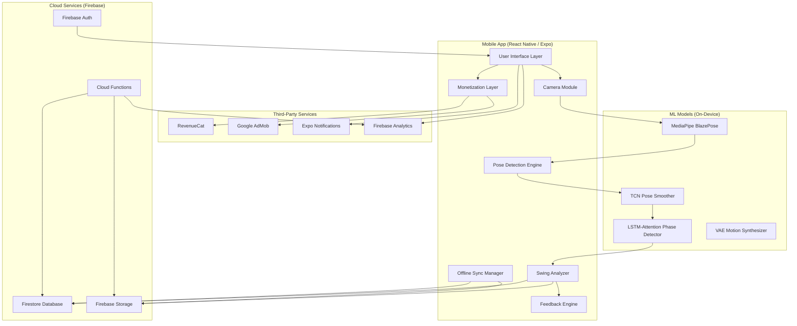
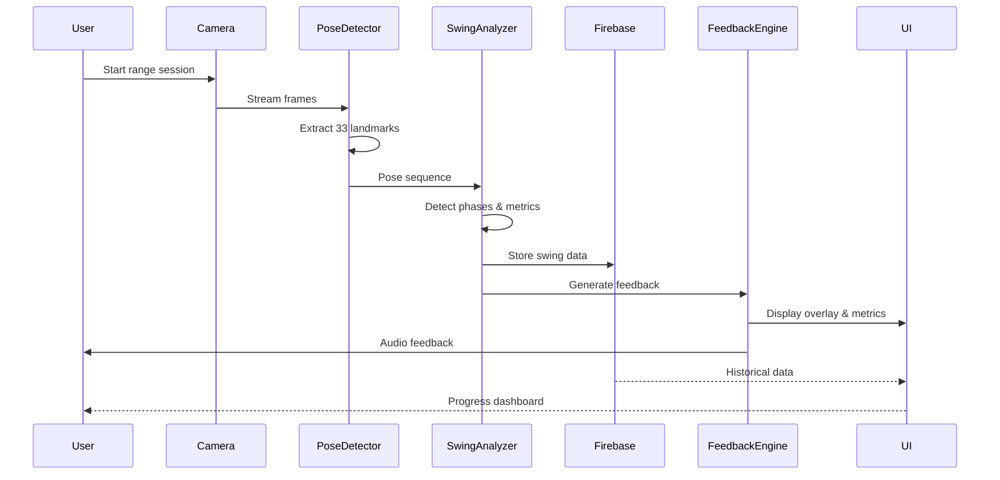
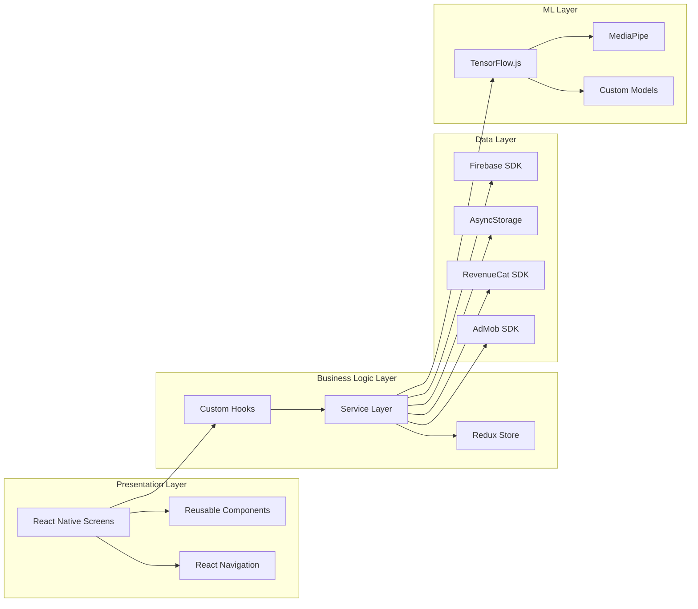

# AI Golf Swing Coach

> *Your personal AI-powered golf coach that automatically captures, analyzes, and improves every swing*

[](https://reactnative.dev/)
[](https://expo.dev/)
[](https://www.typescriptlang.org/)
[](https://firebase.google.com/)
[](https://www.revenuecat.com/)
[](LICENSE)

---

## 📖 Table of Contents

- [Overview](#-overview)
- [Key Features](#-key-features)
- [Architecture](#-architecture)
- [Technology Stack](#-technology-stack)
- [Project Structure](#-project-structure)
- [Getting Started](#-getting-started)
- [Environment Configuration](#-environment-configuration)
- [Firebase Setup](#-firebase-setup)
- [RevenueCat Setup](#-revenuecat-setup)
- [Core Services Documentation](#-core-services-documentation)
- [API Reference](#-api-reference)
- [Testing](#-testing)
- [Deployment](#-deployment)
- [Contributing](#-contributing)
- [License](#-license)

---

## 🏌️ Overview

**AI Golf Swing Coach** is a cross-platform mobile application (iOS & Android) that uses artificial intelligence and computer vision to analyze a golfer's swing in real-time or from recorded video. The app provides instant biomechanical feedback, compares swings to professional templates, tracks progress over time, and offers personalized drills to improve performance.

### Core Value Pillars

| Pillar | Description |
|--------|-------------|
| **Instant Demystification** | Bridges the gap between perceived "feel" and actual physical mechanics through immediate AI video breakdown |
| **Democratized Coaching** | Professional‑grade pose detection and swing plane grading via smartphone camera—no expensive instructor fees |
| **Autonomous Range Sessions** | Smart auto‑capture and auditory feedback for solo practice—no need to walk back to press record between swings |

---

## ✨ Key Features

### 🎯 Smart Range Sessions
- **Hands‑free auto‑capture** – Automatically detects and records swings using motion detection
- **Real‑time audio feedback** – Instant corrective cues during practice using Text‑to‑Speech
- **3D skeleton overlay** – Live pose tracking with biomechanical metrics
- **Swing plane visualization** – Advanced plane lines and angle measurement

### 🔬 Biomechanical Analysis
- **33‑point pose estimation** – Using MediaPipe BlazePose [4†L44-L49]
- **8 biomechanical metrics** – Hip rotation, shoulder rotation, spine angle, knee flex, club head speed, swing plane, tempo, head movement
- **Muscle activation heatmap** – Visualize which muscles are engaged during the swing
- **Injury risk detection** – Identify potentially harmful movement patterns

### 🏆 Pro Comparison
- **Dynamic Motion Similarity Measurement (DMSM)** – Phase‑segmented comparison with pro templates [1†L29-L31]
- **Side‑by‑side video comparison** – Synchronized playback with overlay
- **Built‑in pro library** – Tiger Woods, Annika Sörenstam, Rory McIlroy templates

### 📊 Progress Tracking
- **Adaptive learning engine** – Personalized practice plans based on your swing history
- **Goal setting** – Set and track improvement targets
- **Performance trends** – Charts and metrics over time
- **Gamification** – Achievements, streaks, and daily challenges [1†L18-L24]

### 👨‍🏫 Coach & Team Ecosystem
- **Coach dashboard** – Manage students, review swings, provide feedback
- **Student management** – Assign drills, track progress, send feedback
- **Team plans** – Enterprise features with white‑label support
- **API access** – Programmatic access for integrations

### 💰 Monetization
- **Freemium model** – Free tier with limited swings; premium unlocks advanced features
- **RevenueCat integration** – Subscriptions, entitlements, and consumables
- **Dynamic pricing** – A/B tested paywall variants
- **Referral program** – Rewards for inviting friends

---

## 🏗️ Architecture

### High‑Level Architecture



### Data Flow Diagram



### Component Architecture



---

## 🛠️ Technology Stack

### Frontend

| Technology | Version | Purpose |
|------------|---------|---------|
| React Native | 0.72+ | Cross‑platform mobile framework |
| Expo | 49.0+ | Development & build toolchain |
| TypeScript | 5.0+ | Type‑safe JavaScript |
| React Navigation | 6.x | Navigation & routing |
| Redux Toolkit | 1.9+ | State management |
| React Native Reanimated | 3.x | Smooth animations |
| React Native SVG | 13.x | Vector graphics & overlays |

### Backend & Services

| Technology | Version | Purpose |
|------------|---------|---------|
| Firebase Auth | 9.0+ | Authentication |
| Cloud Firestore | 9.0+ | NoSQL database with offline sync |
| Firebase Storage | 9.0+ | Video & image storage |
| Firebase Cloud Functions | 2.x | Serverless backend |
| Firebase Analytics | 9.0+ | Usage analytics |

### AI/ML

| Technology | Version | Purpose |
|------------|---------|---------|
| TensorFlow.js | 4.0+ | On‑device ML inference |
| MediaPipe BlazePose | Latest | 33‑point pose estimation [4†L44-L49] |
| Custom Models | N/A | TCN smoothing, LSTM phase detection, VAE synthesis |

### Monetization

| Technology | Version | Purpose |
|------------|---------|---------|
| RevenueCat | 4.0+ | Subscriptions & entitlements |
| Google AdMob | 13.0+ | Ad serving |

### Development Tools

| Tool | Purpose |
|------|---------|
| ESLint | Code linting |
| Prettier | Code formatting |
| Jest | Unit testing |
| Detox | E2E testing |
| GitHub Actions | CI/CD |

---

## 📁 Project Structure

```
ai-golf-swing/
├── .env                           # Environment variables
├── .eslintrc.js                   # ESLint configuration
├── .prettierrc                    # Prettier configuration
├── app.json                       # Expo app configuration
├── babel.config.js                # Babel configuration
├── package.json                   # Dependencies & scripts
├── tsconfig.json                  # TypeScript configuration
├── firebase.json                  # Firebase configuration
├── README.md                      # This file
├── LICENSE                        # MIT License
│
├── assets/                        # Static assets
│   ├── icons/                     # App icons
│   ├── splash/                    # Splash screen images
│   └── pose_model/                # MediaPipe model files
│       ├── model.json
│       └── weights.bin
│
├── firebase/                      # Firebase Cloud Functions
│   └── functions/
│       ├── src/
│       │   ├── index.ts           # Function entry point
│       │   ├── revenuecatWebhook.ts
│       │   ├── optimizeRevenue.ts
│       │   └── b2bWebhooks.ts
│       ├── package.json
│       └── tsconfig.json
│
├── src/                           # Application source code
│   ├── App.tsx                    # Root component
│   ├── main.tsx                   # Entry point
│   │
│   ├── components/                # Reusable UI components
│   │   ├── common/                # Generic components
│   │   │   ├── Button.tsx
│   │   │   ├── Card.tsx
│   │   │   ├── Input.tsx
│   │   │   ├── Text.tsx
│   │   │   └── Box.tsx
│   │   ├── ui/                    # UI primitives
│   │   ├── overlays/              # Pose & swing overlays
│   │   │   ├── PoseOverlay.tsx
│   │   │   ├── ThreeDGhostOverlay.tsx
│   │   │   ├── AdvancedSwingPlane.tsx
│   │   │   └── PoseTrackingOverlay.tsx
│   │   ├── range/                 # Range session components
│   │   │   ├── AutoCaptureIndicator.tsx
│   │   │   └── SwingPlaneVisualizer.tsx
│   │   ├── premium/               # Premium feature components
│   │   │   ├── PremiumFeatureBadge.tsx
│   │   │   └── UnlimitedAccessBanner.tsx
│   │   ├── paywall/               # Paywall components
│   │   │   ├── PaywallScreen.tsx
│   │   │   └── PaywallModal.tsx
│   │   └── charts/                # Chart components
│   │       └── RadarChart.tsx
│   │
│   ├── screens/                   # Screen components
│   │   ├── Auth/                  # Authentication screens
│   │   │   ├── LoginScreen.tsx
│   │   │   ├── SignupScreen.tsx
│   │   │   └── OnboardingScreen.tsx
│   │   ├── HomeScreen.tsx
│   │   ├── RangeSessionScreen.tsx
│   │   ├── AnalysisScreen.tsx
│   │   ├── LibraryScreen.tsx
│   │   ├── ProgressScreen.tsx
│   │   ├── ProfileScreen.tsx
│   │   ├── ComparisonScreen.tsx
│   │   ├── DrillDetailScreen.tsx
│   │   ├── GoalScreen.tsx
│   │   ├── SettingsScreen.tsx
│   │   ├── SubscriptionScreen.tsx
│   │   ├── HistoricalDataScreen.tsx
│   │   ├── LiveCoachingScreen.tsx
│   │   ├── SpeedTrackingScreen.tsx
│   │   ├── FittingScreen.tsx
│   │   ├── CoachDashboardScreen.tsx
│   │   └── TeamManagementScreen.tsx
│   │
│   ├── navigation/                # Navigation configuration
│   │   ├── RootNavigator.tsx
│   │   ├── AuthNavigator.tsx
│   │   ├── MainNavigator.tsx
│   │   └── deepLinking.ts
│   │
│   ├── services/                  # Business logic services
│   │   ├── firebase/              # Firebase services
│   │   │   ├── config.ts
│   │   │   ├── auth.ts
│   │   │   ├── firestore.ts
│   │   │   └── storage.ts
│   │   ├── revenuecat/            # RevenueCat services
│   │   │   ├── RevenueCatService.ts
│   │   │   ├── products.ts
│   │   │   ├── purchases.ts
│   │   │   └── consumables.ts
│   │   ├── ads/                   # Ad services
│   │   │   ├── AdMobService.ts
│   │   │   └── AdMediationManager.ts
│   │   ├── ml/                    # Machine Learning
│   │   │   ├── pose/              # Pose detection
│   │   │   │   ├── PoseDetector.ts
│   │   │   │   ├── TransformerPoseEstimator.ts
│   │   │   │   └── IntegratedPosePipeline.ts
│   │   │   ├── phases/            # Phase detection
│   │   │   │   ├── SwingPhaseDetector.ts
│   │   │   │   ├── LSTMAttentionPhaseDetector.ts
│   │   │   │   └── SignalProcessor.ts
│   │   │   ├── metrics/           # Biomechanical metrics
│   │   │   │   └── BiomechanicalMetrics.ts
│   │   │   ├── faults/            # Fault detection
│   │   │   │   └── AdvancedFaultDetector.ts
│   │   │   ├── comparison/        # Pro comparison
│   │   │   │   ├── ProComparisonEngine.ts
│   │   │   │   ├── DMSMEngine.ts
│   │   │   │   └── proTemplates.ts
│   │   │   ├── feedback/          # Feedback generation
│   │   │   │   ├── SwingFeedbackGenerator.ts
│   │   │   │   └── RealTimeFeedbackEngine.ts
│   │   │   ├── smoothing/         # Pose smoothing
│   │   │   │   └── TCNPoseSmoother.ts
│   │   │   ├── synthesis/         # Motion synthesis
│   │   │   │   └── MotionSynthesizer.ts
│   │   │   ├── prediction/        # Ball trajectory
│   │   │   │   └── BallTrajectoryPredictor.ts
│   │   │   └── SwingAnalyzer.ts   # Main analysis orchestrator
│   │   ├── range/                 # Range session services
│   │   │   ├── AutoCaptureEngine.ts
│   │   │   ├── AudioFeedbackEngine.ts
│   │   │   └── SessionSummarizer.ts
│   │   ├── swing/                 # Swing management
│   │   │   └── SwingService.ts
│   │   ├── coach/                 # Coach services
│   │   │   ├── CoachManager.ts
│   │   │   └── CoachAnalytics.ts
│   │   ├── team/                  # Team services
│   │   │   └── TeamManager.ts
│   │   ├── premium/               # Premium features
│   │   │   └── PremiumFeatures.ts
│   │   ├── entitlements/          # Feature gating
│   │   │   ├── FeatureGate.ts
│   │   │   └── UsageManager.ts
│   │   ├── progress/              # Progress tracking
│   │   │   └── ProgressTracker.ts
│   │   ├── gamification/          # Gamification
│   │   │   ├── GamificationEngine.ts
│   │   │   └── ChallengeEngine.ts
│   │   ├── notifications/         # Push notifications
│   │   │   └── NotificationService.ts
│   │   ├── analytics/             # Analytics
│   │   │   ├── AnalyticsService.ts
│   │   │   ├── SubscriptionAnalytics.ts
│   │   │   └── CohortAnalytics.ts
│   │   └── CacheService.ts        # Caching service
│   │
│   ├── hooks/                     # Custom React hooks
│   │   ├── useAuth.ts
│   │   ├── useFeatureGate.ts
│   │   ├── usePremiumFeature.ts
│   │   ├── useRangeSession.ts
│   │   ├── useSwingList.ts
│   │   ├── useSubscription.ts
│   │   ├── useSegmentation.ts
│   │   ├── useHaptic.ts
│   │   ├── useResponsive.ts
│   │   └── useKeyboard.ts
│   │
│   ├── store/                     # Redux state management
│   │   ├── index.ts
│   │   ├── hooks.ts
│   │   └── slices/
│   │       ├── authSlice.ts
│   │       ├── swingSlice.ts
│   │       ├── subscriptionSlice.ts
│   │       ├── rangeSessionSlice.ts
│   │       ├── goalSlice.ts
│   │       └── uiSlice.ts
│   │
│   ├── theme/                     # Design system
│   │   ├── colors.ts
│   │   ├── spacing.ts
│   │   ├── typography.ts
│   │   ├── darkTheme.ts
│   │   └── index.ts
│   │
│   ├── types/                     # TypeScript type definitions
│   │   └── index.ts
│   │
│   └── utils/                     # Utility functions
│       ├── constants.ts
│       ├── helpers.ts
│       ├── validators.ts
│       ├── accessibility.ts
│       ├── retry.ts
│       └── swingMath.ts
│
├── __tests__/                     # Test files
│   ├── unit/
│   ├── integration/
│   └── e2e/
│
└── docs/                          # Additional documentation
    ├── API.md
    ├── DEPLOYMENT.md
    ├── CONTRIBUTING.md
    └── CHANGELOG.md
```

---

## 🚀 Getting Started

### Prerequisites

- **Node.js** 18.0+
- **npm** 9.0+ or **yarn** 1.22+
- **Expo CLI** 5.0+
- **iOS**: Xcode 14+ (macOS only)
- **Android**: Android Studio with SDK 33+
- **Firebase** account (free tier)
- **RevenueCat** account (free tier)

### Installation

1. **Clone the repository**

```bash
git clone https://github.com/yourusername/ai-golf-swing.git
cd ai-golf-swing
```

2. **Install dependencies**

```bash
npm install
# or
yarn install
```

3. **Copy environment variables**

```bash
cp .env.example .env
```

4. **Start the development server**

```bash
npm start
# or
yarn start
```

5. **Run on a device/emulator**

```bash
# iOS
npm run ios

# Android
npm run android
```

---

## 🔧 Environment Configuration

Create a `.env` file in the root directory with the following variables:

```env
# Firebase Configuration
FIREBASE_API_KEY=your_api_key
FIREBASE_AUTH_DOMAIN=your_project.firebaseapp.com
FIREBASE_PROJECT_ID=your_project_id
FIREBASE_STORAGE_BUCKET=your_project.appspot.com
FIREBASE_MESSAGING_SENDER_ID=your_sender_id
FIREBASE_APP_ID=your_app_id

# RevenueCat Configuration
REVENUECAT_API_KEY_IOS=appl_xxxxxxxxxxxxxxxxxxxx
REVENUECAT_API_KEY_ANDROID=goog_xxxxxxxxxxxxxxxxxxxx
REVENUECAT_API_KEY_WEB=rc_xxxxxxxxxxxxxxxxxxxx

# AdMob Configuration
ADMOB_ANDROID_APP_ID=ca-app-pub-xxxxxxxxxxxxxxxx~yyyyyyyyyy
ADMOB_IOS_APP_ID=ca-app-pub-xxxxxxxxxxxxxxxx~yyyyyyyyyy
ADMOB_BANNER_UNIT=ca-app-pub-xxxxxxxxxxxxxxxx/zzzzzzzzzz
ADMOB_INTERSTITIAL_UNIT=ca-app-pub-xxxxxxxxxxxxxxxx/zzzzzzzzzz
ADMOB_REWARDED_UNIT=ca-app-pub-xxxxxxxxxxxxxxxx/zzzzzzzzzz

# API Configuration
API_URL=https://api.aigolf.com

# Sentry (Optional)
SENTRY_DSN=your_sentry_dsn
```

---

## 🔥 Firebase Setup

### 1. Create a Firebase Project

1. Go to the [Firebase Console](https://console.firebase.google.com/)
2. Click **Add project** and follow the setup wizard
3. Enable **Google Analytics** (recommended)

### 2. Enable Authentication

1. In the Firebase Console, navigate to **Authentication** > **Sign-in methods**
2. Enable **Email/Password** and **Google** (optional)
3. Enable **Anonymous** authentication (for guest mode)

### 3. Set Up Firestore Database

1. Navigate to **Firestore Database** > **Create database**
2. Start in **test mode** (you'll update security rules later)
3. Choose your region

### 4. Configure Storage

1. Navigate to **Storage** > **Get started**
2. Set up rules for user‑specific access

### 5. Add Web App to Project

1. Click the **Web** icon (`</>`) to add a web app
2. Register the app and copy the Firebase config
3. Paste the config into your `.env` file

### 6. Firestore Security Rules

```javascript
rules_version = '2';
service cloud.firestore {
  match /databases/{database}/documents {
    // Users collection
    match /users/{userId} {
      allow read, write: if request.auth != null && request.auth.uid == userId;
    }
    
    // Swings collection
    match /swings/{swingId} {
      allow read: if request.auth != null && resource.data.uid == request.auth.uid;
      allow write: if request.auth != null && request.resource.data.uid == request.auth.uid;
    }
    
    // Coach profiles
    match /coach_profiles/{coachId} {
      allow read, write: if request.auth != null && request.auth.uid == coachId;
    }
    
    // Teams
    match /teams/{teamId} {
      allow read: if request.auth != null && resource.data.members.hasAny([request.auth.uid]);
      allow write: if request.auth != null && resource.data.ownerId == request.auth.uid;
    }
  }
}
```

### 7. Storage Security Rules

```javascript
rules_version = '2';
service firebase.storage {
  match /b/{bucket}/o {
    match /videos/{userId}/{allPaths=**} {
      allow read, write: if request.auth != null && request.auth.uid == userId;
    }
    match /thumbnails/{userId}/{allPaths=**} {
      allow read, write: if request.auth != null && request.auth.uid == userId;
    }
  }
}
```

---

## 💰 RevenueCat Setup

### 1. Create a RevenueCat Project

1. Sign up at [RevenueCat](https://www.revenuecat.com/)
2. Create a new project
3. Add your app (iOS and Android)

### 2. Configure Products

1. Navigate to **Products** > **Add product**
2. Create subscription products:
   - `premium_monthly` – $9.99/month
   - `premium_yearly` – $79.99/year
   - `coach_monthly` – $29.99/month
   - `coach_yearly` – $249.99/year

### 3. Create Entitlements

1. Navigate to **Entitlements** > **Add entitlement**
2. Create the following entitlements:
   - `premium` – Maps to premium products
   - `coach` – Maps to coach products
   - `enterprise` – For team plans
   - `ad_free` – Removes ads

### 4. Configure Offerings

1. Navigate to **Offerings** > **Add offering**
2. Create a `default` offering with your packages
3. Set up A/B test variants if needed

### 5. Configure Webhooks

1. Navigate to **Project Settings** > **Webhooks**
2. Add your Firebase Cloud Function URL:
   - `https://us-central1-YOUR_PROJECT.cloudfunctions.net/revenuecatWebhook`
3. Copy the webhook secret for verification

### 6. API Keys

1. Navigate to **Project Settings** > **API Keys**
2. Copy the **Public API Key** (for mobile app)
3. Add the keys to your `.env` file

---

## 📚 Core Services Documentation

### Authentication Service

```typescript
// src/services/firebase/auth.ts

// Sign in with email and password
const user = await signIn(email, password);

// Create a new account
const user = await signUp(email, password, displayName, handicap, handedness);

// Sign out
await logout();

// Reset password
await resetPassword(email);

// Get current user
const user = getCurrentUser();

// Get user profile from Firestore
const profile = await getUserProfile(uid);
```

### Swing Service

```typescript
// src/services/swing/SwingService.ts

// Save a new swing
const swing = await SwingService.saveSwing({
  uid: 'user123',
  videoURL: 'https://...',
  recordedAt: new Date(),
  club: 'Driver',
  metrics: { hipRotation: { value: 35, unit: 'deg', confidence: 0.9 } },
});

// Get a swing by ID
const swing = await SwingService.getSwing('swing_123');

// Get all swings for a user
const swings = await SwingService.getUserSwings('user123');

// Delete a swing
await SwingService.deleteSwing('swing_123');

// Upload a video
const videoURL = await SwingService.uploadVideo('file://...', 'user123');
```

### Swing Analysis Service

```typescript
// src/services/ml/SwingAnalyzer.ts

// Initialize the analyzer
const analyzer = new SwingAnalyzer();
await analyzer.initialize();

// Analyze a swing video
const result = await analyzer.analyze('file://video.mp4', 'tiger_woods');

// Result contains:
// - poses: Keypoint3D[][] (pose sequence)
// - phases: SwingPhase[] (phase labels)
// - metrics: GolfMetrics (biomechanical metrics)
// - faults: SwingFault[] (detected faults)
// - comparison: SimilarityScore (pro comparison)
// - overallScore: number (0-100)
```

### Feature Gating

```typescript
// src/services/entitlements/FeatureGate.ts

const gate = FeatureGate.getInstance();

// Check if user has access to a feature
const hasAccess = await gate.hasAccess(userId, 'pro_comparison');

// Get all features for a tier
const features = gate.getFeaturesForTier('premium');

// Available features:
// - basic_swing_score (free)
// - video_storage (free)
// - biomechanical_breakdown (premium)
// - customized_drills (premium)
// - pro_comparison (premium)
// - auto_capture (premium)
// - audio_feedback (premium)
// - coach_student_management (coach)
// - team_analytics (enterprise)
// - white_label (enterprise)
// - api_access (enterprise)
```

### Usage Management

```typescript
// src/services/entitlements/UsageManager.ts

const manager = UsageManager.getInstance();

// Get current usage for the month
const usage = await manager.getCurrentUsage(userId);

// Check if quota is exceeded
const result = await manager.isQuotaExceeded(userId);
// result.exceeded: boolean
// result.reason: string (if exceeded)

// Free tier quotas:
// - swingsPerMonth: 5
// - videoStorageDays: 7
// - maxDrills: 3
```

### Auto‑Capture Engine

```typescript
// src/services/range/AutoCaptureEngine.ts

const engine = new AutoCaptureEngine();

// Start auto‑capture
engine.start();

// Feed poses from the camera loop
engine.feedPose(pose);

// Listen for events
engine.on('swing_detected', (event) => {
  // event.timestamp, event.duration, event.pose
});

engine.on('pose_updated', (event) => {
  // Update UI with latest pose
});

// Stop auto‑capture
engine.stop();
```

### Audio Feedback Engine

```typescript
// src/services/range/AudioFeedbackEngine.ts

const feedback = new AudioFeedbackEngine();

// Generate feedback from analysis result
const text = feedback.generateFeedback(analysisResult);

// Speak feedback
await feedback.speak(text);

// Real‑time feedback
await feedback.realTimeFeedback('hipRotation', value, threshold);
```

---

## 🔌 API Reference

### REST API Endpoints (Firebase Cloud Functions)

| Endpoint | Method | Description |
|----------|--------|-------------|
| `/revenuecatWebhook` | POST | RevenueCat webhook handler |
| `/optimizeRevenue` | POST | Trigger revenue optimization |
| `/api/coach/students` | GET | Get coach's students |
| `/api/coach/feedback` | POST | Submit feedback on a swing |
| `/api/teams` | GET/POST | Team management |
| `/api/teams/:id/members` | POST/DELETE | Add/remove team members |
| `/api/analytics/cohort` | GET | Cohort retention data |

### WebSocket/WebRTC (Live Coaching)

- **Signaling**: Firestore real‑time listeners
- **Media**: WebRTC peer‑to‑peer
- **Annotations**: Firestore real‑time sync

---

## 🧪 Testing

### Unit Tests

```bash
npm test
# or
yarn test
```

### Integration Tests

```bash
npm run test:integration
```

### E2E Tests (Detox)

```bash
# iOS
npm run test:e2e:ios

# Android
npm run test:e2e:android
```

---

## 🚢 Deployment

### iOS (App Store)

```bash
# Build for production
expo build:ios

# Or use EAS
eas build --platform ios

# Submit to App Store
eas submit --platform ios
```

### Android (Google Play)

```bash
# Build for production
expo build:android

# Or use EAS
eas build --platform android

# Submit to Google Play
eas submit --platform android
```

### Firebase Cloud Functions

```bash
cd firebase/functions
npm install
npm run build
firebase deploy --only functions
```

---

## 🤝 Contributing

1. Fork the repository
2. Create a feature branch (`git checkout -b feature/amazing-feature`)
3. Commit your changes (`git commit -m 'Add amazing feature'`)
4. Push to the branch (`git push origin feature/amazing-feature`)
5. Open a Pull Request

### Development Guidelines

- **TypeScript**: All code must be fully typed
- **Testing**: Unit tests required for all services
- **Documentation**: Update README and API docs
- **Code Style**: Follow ESLint and Prettier rules

---

## 📄 License

This project is licensed under the MIT License – see the [LICENSE](LICENSE) file for details.

---

## 🙏 Acknowledgments

- [MediaPipe](https://developers.google.com/mediapipe) for pose detection [4†L44-L49]
- [TensorFlow.js](https://www.tensorflow.org/js) for on‑device ML
- [RevenueCat](https://www.revenuecat.com/) for subscription management
- [Expo](https://expo.dev/) for the development platform
- [Firebase](https://firebase.google.com/) for backend services

---

## 📞 Contact

- **Project Maintainer**: [Your Name](mailto:you@example.com)
- **GitHub Issues**: [Issue Tracker](https://github.com/yourusername/ai-golf-swing/issues)
- **Discord**: [Join our community](https://discord.gg/your-invite)

---

*Built with ❤️ by the AI Golf Swing Coach team*
